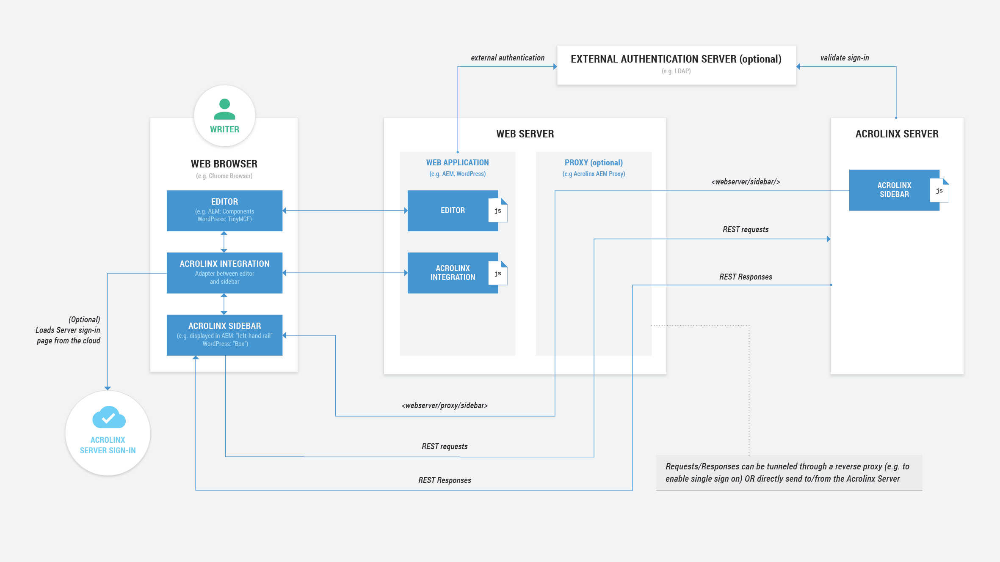

# Acrolinx Single Sign-On Proxy Sample

Demo code for implementing a proxy in a single sign-on environment for [Acrolinx](https://www.acrolinx.com/) Sidebar integrations.

## Prerequisites

Please contact [Acrolinx SDK support](https://github.com/acrolinx/acrolinx-coding-guidance/blob/main/topics/sdk-support.md)
for consulting and getting your integration certified.
This sample works with a test license on an internal Acrolinx URL.
This license is only meant for demonstration and developing purposes.
Once you finished your integration, you'll have to get a license for your integration from Acrolinx.
  
Acrolinx offers different other SDKs, and examples for developing integrations.

Before you start developing your own integration, you might benefit from looking into:

* [Build With Acrolinx](https://support.acrolinx.com/hc/en-us/categories/10209837818770-Build-With-Acrolinx), and
* the [Guidance for the Development of Acrolinx Integrations](https://github.com/acrolinx/acrolinx-coding-guidance).

## Overview



## Configuration of the Sample

### Configure the Acrolinx Platform

To enable single sign-on, add the following example properties to the `coreserver.properties` file:

```properties
singleSignOn.genericPassword=secret
```

See: [ About Single Sign-On with Acrolinx ](https://support.acrolinx.com/hc/en-us/articles/10306041280274-About-Single-Sign-On-with-Acrolinx).

*Note: Make sure that you use a proper secret for the `genericPassword`.*
*Note: Older Acrolinx Platform versions might require more configuration properties to be set.*

### Configure the Integration

In the [`config.js`](https://github.com/acrolinx/acrolinx-sidebar-demo/blob/main/samples/config.js) of your Acrolinx Integration,
set the Acrolinx URL to point to the relative proxy path as follows:

```javascript
serverAddress: '/proxy-sample/proxy'
```

Make sure:

* the webserver running the proxy delivers the HTML of the integration.
* the relative proxy path points to the correct location of your proxy.

See also:

* [Acrolinx Sidebar Demo](https://github.com/acrolinx/acrolinx-sidebar-demo)

### Configure the Proxy

#### Java Servlet

[Acrolinx Java Proxy Servlet](java/servlet/README.md)

#### PHP

[Acrolinx PHP Proxy](php/README.md)

### Security

Make sure to implement the proxy in a [secure way](https://github.com/acrolinx/acrolinx-coding-guidance/blob/main/topics/security-safety.md#security).
Especially take care of:

* The entire authentication is checked in the proxy layer.
* The username is already authenticated in the system you integrate.
* The proxy adds the username header and the SSO token header.
* The SSO token is kept secret between the system's backend and the Acrolinx Platform.
* It's impossible to fake a request to the proxy and obtain an authentication token
  for a different user than the authenticated user.

#### Connection / TLS / Pitfall

The Acrolinx Platform usually runs on state-of-the-art security standards.
Out of the box and HTTP clients might not be able to connect.
Make sure that you configured your VM, operating system, and backend to allow connections with modern
[TLS versions](https://en.wikipedia.org/wiki/Transport_Layer_Security).

*Note:* [test-ssl.acrolinx.com](https://test-ssl.acrolinx.com) is configured to allow more TLS versions than typical
production instances usually do.
The reasoning behind this is to support older environments and simplify testing.
Please make sure to test with an appropriate configuration before rollout.

## License

Copyright 2015-present Acrolinx GmbH

Licensed under the Apache License, Version 2.0 (the "License");
you may not use this file except in compliance with the License.
You may obtain a copy of the License at:

[https://www.apache.org/licenses/LICENSE-2.0](https://www.apache.org/licenses/LICENSE-2.0)

Unless required by applicable law or agreed to in writing, software
distributed under the License is distributed on an "AS IS" BASIS,
WITHOUT WARRANTIES OR CONDITIONS OF ANY KIND, either express or implied.
See the License for the specific language governing permissions and
limitations under the License.

For more information visit: [https://www.acrolinx.com](https://www.acrolinx.com)
